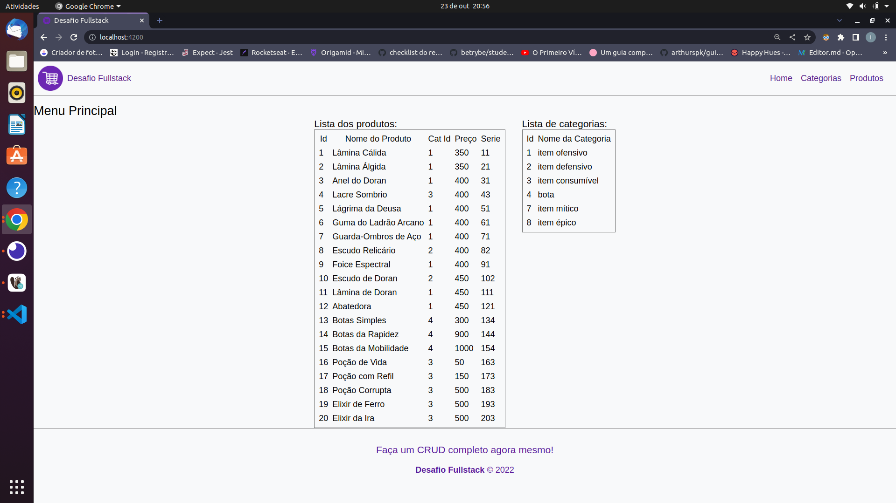
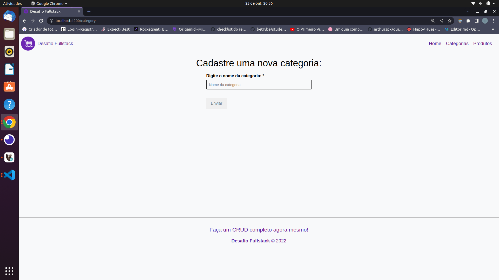
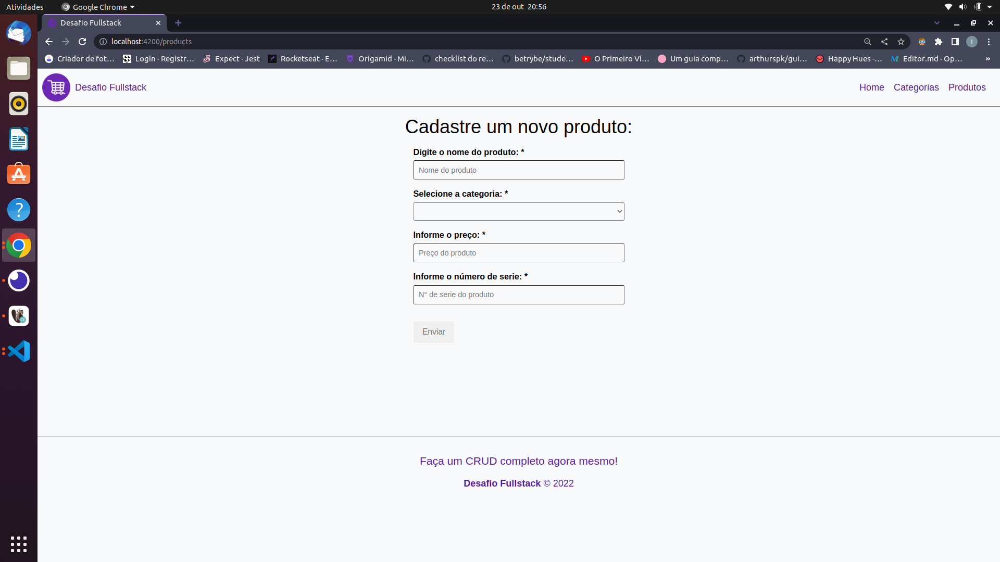

# Desafio Fullstack - Frontend

Projeto frontend que tem a finalidade de mostrar via interface gráfica dados vindo de um backend integrado com o frontend, caso esteja lendo aqui sem antes passar pela documentação do backend, recomendamos fortemente começar fazendo as configurações de backend anteriormente. Nesse projeto usamos a versão 14.2.6 do Angular e utilizamos CSS para fazer a estilização das páginas. Exemplo de algumas páginas ainda em desenvolvimento:

* Página Inicial



* Página Categorias



* Página Produtos



## 🚀 Sobre mim
Eu sou uma pessoa desenvolvedora fullstack jr, desenvolvo os meus projetos frontend com HTML, CSS, Javascript e React e no Backend com Node usando o Express e Typescript. Primeira vez codando em python e sempre buscando aprender novas tecnologias.

## Aprendizados

Foi um grande desafio aprender um framework diferente do React, apesar de ambos terem a dinâmica de componente bem semelhante, o Angular tem muitas peculiaridades em seu uso, um exemplo disso é o uso de comandos do CLI que pode gerar componentes e serviços. Um outro ponto desafiador foi a integração de requisições HTTP no angular que é um pouco diferente de tudo que eu pude ver até agora, pois o Angular tem o seu jeito próprio de criar e se integrar com o backend.


## Stack utilizada

**Front-end:** Angular, Typescript e CSS;


## Documentação
* Para instalação do [Angular](https://angular.io/start) em sua máquina

## Instalação

Instale o meu projeto clonando do o repositório pela chave SSH.

```bash
  $ git clone git@github.com:IanDeSa/desafio-fastAPI-frontend.git
```
Entre na pasta do projeto e instale as dependências do projeto.
```bash
  $ cd desafio-fastAPI-frontend
  $ npm install
```
Para rodar o projeto execute o comando:
```bash
  $ ng serve
```

## Melhorias

O projeto não foi concluído e tem várias possíveis melhorias que eu gostaria de implementar, pela falta de experiência com a ferramenta foi bastante complicado executar algumas funções, mas pelo resultado final ainda assim estou bem feliz com o que eu consegui fazer em tão pouco tempo. Algumas melhorias urgentes seriam a interação com usuário, incluindo mensagem de resposta do servidor, carregando na tela quando precisar de respostas, testes, linter e stylelinter, criar o estilo responsivo e novas features do crud que já estão implementadas no backend e poderiam certamente serem incluídas como features novas no frontend.

## Autor

- [@IanDeSa](https://github.com/IanDeSa)

## Feedback

Se você tiver algum feedback, por favor nos deixe saber por meio do email: contato.iansantos@gmail.com

